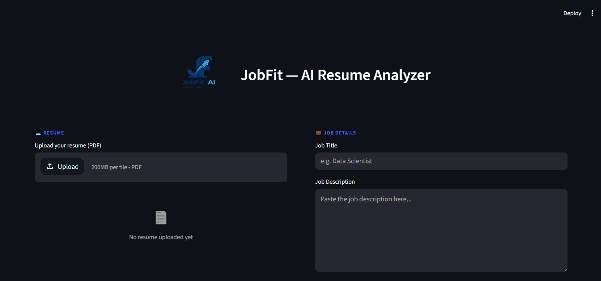
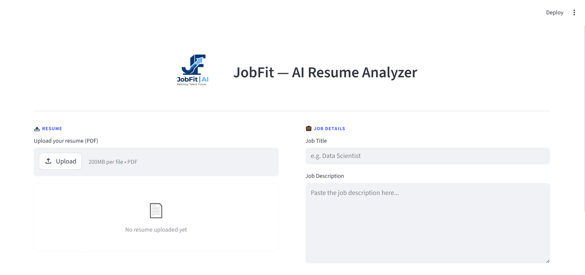

# JobFit — AI Resume Analyzer

JobFit is an AI-powered web application that analyzes resumes and matches them with job descriptions using LLMs (Groq API). It provides feedback, scoring, skill gaps, and an interactive AI chat coach to improve your CV in real-time.

---

## 🚀 Features

- 📄 Upload PDF resumes
- 🤖 AI-powered resume analysis (Groq LLM)
- 🎯 Job matching score (ATS-style evaluation)
- ✅ Strengths & weaknesses detection
- 🛠️ Actionable improvement suggestions
- 💬 AI chat coach for resume Q&A
- 🧾 Automatic user extraction (name, email, phone)
- 💾 SQLite database storage
- 🎨 Modern Streamlit UI with custom styling

---

## 🏗️ Tech Stack

- Python 🐍
- Streamlit 🎈
- Groq API 🤖 (LLM inference)
- SQLite 🗄️
- PyPDF2 📄
- dotenv 🔐
- HTML/CSS (custom UI styling)

---

## 📂 Project Structure

```

AI_JobFit/
├── db_setup.py            # Database Configuration
├── config.py              
├── resume_analyzer.py     # Application entry point (Streamlit)
├── .env                   # Sensitive credentials (ignored by git)

```

---
### Interface Page / Dark


### Interface Page / Light


---

## ⚙️ Installation

### 1. Clone the repo
```bash
git clone https://github.com/CondoRHxH/AI_ResumeAnalyze
cd AI_ResumeAnalyze
```

### 2. Create virtual environment
```bash
python -m venv venv
source venv/bin/activate   # Mac/Linux
venv\Scripts\activate      # Windows
```

### 3. Install dependencies
```bash
pip install -r requirements.txt
```
### 4. Add environment variables
```bash
Create .env file:

GROQ_API_KEY=your_api_key_here
GROQ_MODEL=llama-3.1-8b-instant
```

### 5. Run the app
```bash
streamlit run resume_analyzer.py
```